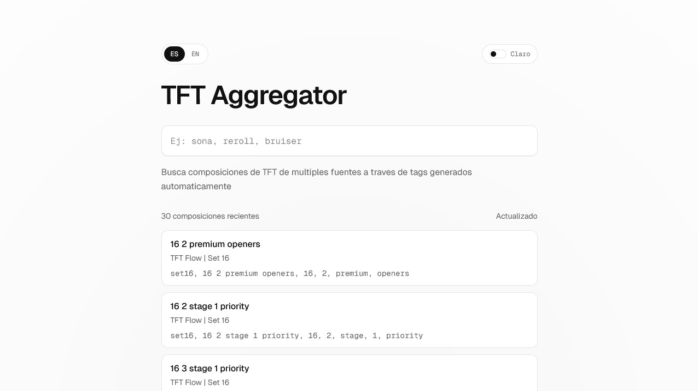

# TFT Aggregator

Buscador de composiciones de Teamfight Tactics (TFT) que agrega resultados desde varias fuentes públicas mediante sitemaps, normaliza tags automáticamente y permite búsqueda en español e inglés.

Idiomas: [English](./README.md) | [Español](./README.es.md)

## Captura



## Demo local rápida

1. Instala dependencias:

```bash
npm install
```

2. Levanta el entorno de desarrollo:

```bash
npm run dev
```

3. Abre en el navegador:
- `http://localhost:3000/es` (español)
- `http://localhost:3000/en` (inglés)

## Qué hace

- Indexa composiciones desde múltiples fuentes externas.
- Extrae metadata desde URLs (set, nombre, tags).
- Genera sugerencias de búsqueda por frecuencia de tags.
- Prioriza resultados por coincidencia exacta/parcial y set más reciente.
- Soporta i18n (`es` / `en`) y tema claro/oscuro.

## Fuentes indexadas

- TFT Academy: `https://tftacademy.com/sitemap.xml`
- TFT Flow: `https://tftflow.com/sitemap.xml`
- AKAWonder: `https://compos.akawonder.com/sitemap.xml`

Nota: en `/en` se excluyen resultados de `AKAWonder` por configuración de locale.

## Stack

- Next.js 16 (App Router)
- React 19
- TypeScript
- Tailwind CSS 4

## Scripts

```bash
npm run dev     # entorno local
npm run build   # build de producción
npm run start   # servidor de producción
npm run lint    # lint con ESLint
```

## Variables de entorno

Para URLs canónicas y metadatos SEO, el proyecto usa esta prioridad:

1. `NEXT_PUBLIC_SITE_URL`
2. `SITE_URL`
3. `VERCEL_PROJECT_PRODUCTION_URL`
4. `VERCEL_URL`
5. fallback: `http://localhost:3000`

Ejemplo:

```bash
NEXT_PUBLIC_SITE_URL=https://tu-dominio.com
```

## Arquitectura (resumen)

- `app/es/page.tsx` y `app/en/page.tsx`: páginas por idioma con metadata y carga inicial.
- `app/components/tft-search.tsx`: UI de búsqueda con debounce y actualización reactiva.
- `app/actions/search.ts`: server action para consultas seguras.
- `lib/tft/index.ts`: indexación, parsing de sitemaps, scoring y sugerencias.
- `lib/i18n.ts`: copy y validación de locales.
- `app/robots.ts` y `app/sitemap.ts`: SEO técnico base.

## Caché y revalidación

- El índice agregado se cachea con `unstable_cache`.
- Revalidación cada 30 minutos (`1800s`).

## Consideraciones

- Si una fuente externa falla o cambia su estructura de URL, esa fuente puede devolver 0 resultados temporalmente.
- El sistema evita romper la app devolviendo listas vacías cuando una fuente no responde correctamente.

## Despliegue

Compatible con Vercel o cualquier plataforma Node.js que soporte Next.js.

```bash
npm run build
npm run start
```

